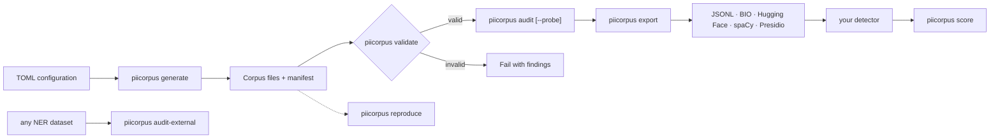

# PIIcorpus

[](https://github.com/rasam08/PIIcorpus/actions/workflows/ci.yml)
[](pyproject.toml)
[](LICENSE)
[](https://github.com/rasam08/PIIcorpus/releases/latest)

PIIcorpus is a detector-neutral Python tool for generating, auditing, and scoring against
deterministic synthetic contextual-PII corpora without using real personal data.

Its focus is structural quality, not volume:

> PIIcorpus does not merely generate synthetic examples. It checks whether its generated splits
> are structurally independent, exposes common synthetic-corpus failure modes — contamination,
> template memorization, morphology-to-label and shape-to-entity shortcuts, cue shortcuts,
> within-split redundancy, insufficient diversity, and generator fingerprints — and tests for
> learnable surface signal with a class-balanced trivial-model probe. The same audit runs on external
> NER datasets, and a scoring harness turns detector predictions into mechanism diagnostics.

The project generates, audits, and scores against corpora. It does not train, evaluate, select,
approve, or package machine-learning models.

## Pipeline at a glance



Generation is deterministic for a fixed package version, normalized configuration, and seed —
`piicorpus reproduce` verifies it by regenerating from the corpus's own configuration snapshot and
byte-comparing. Validation recalculates corpus invariants before audit, export, or scoring
consumes the files.

## Five-minute quickstart

Python 3.11 or newer is required.

```console
python -m venv .venv
python -m pip install -e .
piicorpus generate --config configs/demo.toml --out demo-output
piicorpus validate demo-output
piicorpus audit demo-output --probe
piicorpus export demo-output --format huggingface
piicorpus reproduce demo-output
```

Two configurations ship with the project:

- `configs/demo.toml` — the fictional SYN- demo. Labels `PATIENT_RECORD_ID`,
  `TRAVEL_DOCUMENT_ID`, `DRIVER_CREDENTIAL_ID`, and `BIRTH_DATE` use intentionally fictional
  identifier shapes with a synthetic prefix. The audit deliberately reports the constant prefix as
  a `WARN` (`value_shared_affix`) — safe values, visible trade-off.
- `configs/realistic-safe.toml` — realistic-but-reserved surfaces: RFC 2606 emails, 555-01XX
  phone numbers, Luhn-invalid card shapes, RFC 5737 documentation IPs, and never-issued
  9XX-XX-XXXX national-id shapes. Safety runs in verifier mode (each plugin proves its values are
  reserved), so detector regexes get realistic shapes with no synthetic prefix and no affix
  warning. See [`docs/DATA_SAFETY.md`](docs/DATA_SAFETY.md) for the reservation rationale.

The manifest records the seed, generator version, normalized configuration digest, counts, file
hashes, determinism metadata, and the CC0-1.0 generated-data license.

## What generation writes

```text
demo-output/
  corpus-config.json
  manifest.json
  splits/
    train.jsonl
    eval.jsonl
    holdout.jsonl
```

Running the same package version with the same configuration and seed produces byte-identical
files. A different seed changes generated records while keeping configured sizes, ratios, safety
rules, and diversity requirements intact. Splits draw personas, organizations, letters, and years
from shared pools partitioned by interleaving, so they stay disjoint without the obvious
order-driven shift a contiguous alphabetical or chronological split would create. Arbitrary
user-supplied pools are not claimed to be statistically identical across splits.

The repository forces LF line endings for JSON and JSONL files through `.gitattributes`, including
on Git for Windows checkouts, so checkout conversion does not invalidate corpus byte hashes.

## Validation failure example

The validator recalculates invariants from emitted files. It does not accept manifest counts as
proof. If a split is changed after generation, validation exits with code 1:

```text
FAIL: 2 validation finding(s)
- file_hash: SHA-256 mismatch for splits/eval.jsonl
- manifest_counts: manifest counts for eval do not match emitted records
```

Operational errors, such as a missing file or invalid TOML, exit with code 2 and are never presented
as a clean corpus verdict (`--traceback` re-raises them for debugging).

Audit, export, and score all run strict validation before consuming a corpus. Tampered records,
stale content-derived IDs, or inconsistent manifests exit with findings and produce no output by
default. `--forensic-allow-invalid` is available for investigation, but it is deliberately
failure-preserving and cannot produce a clean audit.

## Audit example

```text
PASS       shape_entity_shortcut     count=0  measured=0.8161 threshold=0.9
PASS       cue_label_shortcuts       count=59 measured=0.3151 threshold=0.45
PASS       intra_split_redundancy    count=0  measured=0.0    threshold=0.05
WARN       value_shared_affix        count=4  measured=11     threshold=6
PASS       probe_kind_separability   count=2  measured=0.8554 threshold=0.9
PASS       threshold_strictness      count=0
UNMEASURED same_generator_holdout_dependence
```

Every risk is reported as `PASS`, `FAIL`, `WARN`, or `UNMEASURED` with a count, the measured
value, the threshold it was judged against, and a reason. The `threshold_strictness` finding warns
whenever the corpus configuration is laxer than the recommended reference profile, and
`--profile reference` runs the audit with the reference thresholds directly. JSON and Markdown
output are available for automation and review. The full risk catalog is in
[`docs/FAILURE_MODEL.md`](docs/FAILURE_MODEL.md).

`--probe` additionally trains a deterministic stdlib trivial model (hashed character n-grams and
logistic regression) and reports balanced accuracy, macro-F1, raw accuracy, and split-specific
baselines for kind, value-to-label, and context-to-label prediction. A failure requires balanced
accuracy above both the configured ceiling and the majority-predictor baseline margin.

> A holdout produced by the same generator is useful for regression testing but is not an
> independent generalization test.

## Auditing external datasets

The structural checks that need no generator metadata — contamination, duplicates, redundancy,
shape and marker shortcuts, value diversity, span integrity, and the probe — run on any NER
dataset:

```console
piicorpus audit-external --format hf --split train=train.jsonl --split test=test.jsonl
piicorpus audit-external data.conll --format conll
piicorpus audit-external records.jsonl --format jsonl   # import output is directly consumable
```

Checks that require the generating configuration report `UNMEASURED`, and a sensitive-content
scan over the text is reported as a warning (`--fail-on-safety` promotes it).

## Scoring a detector

`piicorpus score` consumes span predictions from any detector (see
[`docs/FORMAT.md`](docs/FORMAT.md) for the one-line-per-record format) and reports
precision/recall/F1 per label, family, kind, and split — plus mechanism diagnostics built from
the engineered families:

```text
diagnostics:
  cue_dependence                    0.04   (cued recall minus cue-free recall)
  conflict_gold_recall               1.0
  shape_hint_substitution_rate       0.0
  other_error_rate                   0.0
  abstention_rate                    0.0
  spoken_recall                     0.0
  over_trigger_per_hard_negative_family {'hard_negative_near_misses': 1.0, ...}
```

A shape-only regex detector will over-trigger on near-miss hard negatives — which now carry
identifier-shaped values precisely so that this failure is measurable. Scores on synthetic data
demonstrate mechanism failures, never real-world adequacy; see
[`docs/CLAIM_BOUNDARIES.md`](docs/CLAIM_BOUNDARIES.md).

## Families and extension points

The demo covers narrative prose, structural records, OCR-like noise, spoken values, mixed-entity
documents, cue-free positives, cue-versus-shape conflicts, near misses, placeholders, negation,
documentation references, unrelated identifier-shaped values, and adjacent non-sensitive values.
Near-miss and adjacent negatives generate their values through the configured label plugins, so
hard negatives mirror the positive value distribution for any label set.

Configuration controls labels, cue surfaces, value plugins, family plugins, persona and
organization pools (`[surfaces]`), split sizes, class balance, diversity floors, audit thresholds,
probe ceilings, and safety rules. Applications register extensions with `register_value_plugin`,
`register_family`, `register_shape`, and `register_value_verifier`; no built-in label set is
required by the engine. The CLI loads registration modules with `--plugins mymodule` or
automatically through the `piicorpus.plugins` entry-point group:

```toml
[project.entry-points."piicorpus.plugins"]
acme = "acme_pii:register"
```

## Annotation and formats

Human-readable markup uses `[[ENTITY_TYPE:value]]`:

```text
The record identifier is [[PATIENT_RECORD_ID:SYN-ID-A10427]].
```

The parser emits clean text, Unicode code-point offsets, and UTF-8 byte offsets. Nested, unclosed,
malformed, or overlapping annotations fail loudly. Exporters are provided for generic JSONL, BIO,
Hugging Face-compatible per-split JSONL, a spaCy-convertible JSONL form, and Presidio fixtures;
every export includes a `labels.json` tag map. Details are in [`docs/FORMAT.md`](docs/FORMAT.md).

Imported marked text remains `human_supplied` and unassigned; unannotated lines are typed
`unannotated`, not hard negatives. Import scans text for sensitive-content patterns and reports
findings in its manifest, but import does not establish consent, privacy, provenance, licensing,
safety, or release suitability, and it never mixes records into generated splits without a
separate explicit process.

## Architecture

- `config.py` parses and normalizes TOML, including surfaces, probe, and safety modes.
- `generator.py`, `skeletons.py`, and `morphology.py` implement deterministic plugin registries
  (values, families, shapes) and thirty-template-per-family banks.
- `plugins_realistic.py` provides reserved-surface value plugins with reservedness verifiers.
- `annotation.py` owns marked-text parsing and span round trips.
- `validators/` derives structural, diversity, hash, and safety verdicts from output files.
- `failure_model.py` runs the registered audit checks; `similarity.py` provides MinHash/LSH
  near-duplicate detection; `probe.py` is the trivial-model learnability probe;
  `profiles.py` holds the reference threshold profile.
- `scoring.py` compares detector predictions against a corpus.
- `importers/` (annotated and external) and `exporters/` keep provenance and spans explicit.

The base installation has no third-party runtime dependency.

## Limitations

- Synthetic data does not prove real-world accuracy.
- A same-generator holdout is not independent.
- Diversity counts do not prove semantic diversity.
- Template variation can still leave a generator fingerprint.
- PIIcorpus does not guarantee that generated identifiers are realistic; the realistic-safe
  plugins guarantee only that realistic shapes are reserved, fictional, or invalid by design.
- PIIcorpus does not guarantee regulatory compliance.
- PIIcorpus does not de-identify real data.
- PIIcorpus does not make a model ready for deployment.
- Human-authored or externally sourced evaluation remains necessary.
- The project generates, audits, and scores against corpora; it does not train or approve models.

See [`docs/CLAIM_BOUNDARIES.md`](docs/CLAIM_BOUNDARIES.md) for the full boundary.

## Contributing and security

Install the reviewed development lock and the editable package, then run:

```console
python -m pip install --requirement requirements-dev.lock
python -m pip install --no-deps --no-build-isolation -e .
ruff check .
mypy src
pytest
python -m build
```

Contribution guidance is in [`CONTRIBUTING.md`](CONTRIBUTING.md). Report vulnerabilities through
[GitHub private vulnerability reporting](https://github.com/rasam08/PIIcorpus/security/advisories/new),
not a public issue.

Source code is Apache-2.0. Generated demo data is CC0-1.0; see `DATA_LICENSE`. User-supplied and
external data retains its own terms.
