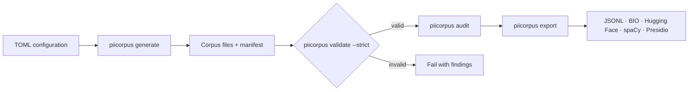

# PIIcorpus

[](https://github.com/rasam08/PIIcorpus/actions/workflows/ci.yml)
[](pyproject.toml)
[](LICENSE)
[](https://github.com/rasam08/PIIcorpus/releases/latest)

PIIcorpus is a detector-neutral Python tool for generating and auditing deterministic synthetic
contextual-PII corpora without using real personal data.

Its focus is structural quality, not volume:

> PIIcorpus does not merely generate synthetic examples. It checks whether its generated splits
> are structurally independent and exposes common synthetic-corpus failure modes such as
> contamination, template memorization, morphology-to-label shortcuts, cue shortcuts, insufficient
> diversity, and generator fingerprints.

The project generates and audits corpora. It does not train, evaluate, select, approve, or package
machine-learning models.

## Pipeline at a glance



Generation is deterministic for a fixed package version, normalized configuration, and seed.
Validation recalculates corpus invariants before audit or export consumes the files.

## Five-minute quickstart

Python 3.11 or newer is required.

```console
python -m venv .venv
python -m pip install -e .
piicorpus generate --config configs/demo.toml --out demo-output
piicorpus validate demo-output --strict
piicorpus audit demo-output --format text
piicorpus export demo-output --format huggingface
```

The built-in example uses the public labels `PATIENT_RECORD_ID`, `TRAVEL_DOCUMENT_ID`,
`DRIVER_CREDENTIAL_ID`, and `BIRTH_DATE`. Identifier shapes are intentionally fictional and do not
represent formats used by medical, passport, driver-license, or other issuing authorities.

The manifest records the seed, generator version, normalized configuration digest, counts, file
hashes, determinism metadata, and the CC0-1.0 generated-data license.

## What generation writes

```text
demo-output/
  corpus-config.json
  manifest.json
  splits/
    train.jsonl
    eval.jsonl
    holdout.jsonl
```

Running the same package version with the same configuration and seed produces byte-identical
files. A different seed changes generated records while keeping configured sizes, ratios, safety
rules, and diversity requirements intact.

The repository forces LF line endings for JSON and JSONL files through `.gitattributes`, including
on Git for Windows checkouts, so checkout conversion does not invalidate corpus byte hashes.

## Validation failure example

The validator recalculates invariants from emitted files. It does not accept manifest counts as
proof. If a split is changed after generation, validation exits with code 1:

```text
FAIL: 2 validation finding(s)
- file_hash: SHA-256 mismatch for splits/eval.jsonl
- manifest_counts: manifest counts for eval do not match emitted records
```

Operational errors, such as a missing file or invalid TOML, exit with code 2 and are never presented
as a clean corpus verdict.

Audit and export both run strict validation before consuming a corpus. Tampered records, stale
content-derived IDs, or inconsistent manifests exit with findings and produce no export by default.
`--forensic-allow-invalid` is available for investigation, but it is deliberately
failure-preserving and cannot produce a clean audit.

## Audit example

```text
PASS       cross_split_value_contamination
PASS       label_exclusive_morphology
PASS       cue_free_coverage
PASS       hard_negative_coverage
UNMEASURED same_generator_holdout_dependence
```

Every risk is reported as `PASS`, `FAIL`, or `UNMEASURED`, with a count and a reason. JSON and
Markdown output are available for automation and review.

> A holdout produced by the same generator is useful for regression testing but is not an
> independent generalization test.

## Families and extension points

The demo covers narrative prose, structural records, OCR-like noise, spoken values, mixed-entity
documents, cue-free positives, cue-versus-shape conflicts, near misses, placeholders, negation,
documentation references, unrelated identifier-shaped values, and adjacent non-sensitive values.

Configuration controls labels, cue surfaces, value plugins, family plugins, split sizes, class
balance, diversity floors, audit thresholds, and safety rules. Applications can register a new
value generator with `register_value_plugin` and a new family with `register_family`; no built-in
label set is required by the engine.

## Annotation and formats

Human-readable markup uses `[[ENTITY_TYPE:value]]`:

```text
The record identifier is [[PATIENT_RECORD_ID:SYN-ID-A10427]].
```

The parser emits clean text, Unicode code-point offsets, and UTF-8 byte offsets. Nested, unclosed,
malformed, or overlapping annotations fail loudly. Exporters are provided for generic JSONL, BIO,
Hugging Face-compatible JSONL, a spaCy-convertible JSONL form, and Presidio fixtures. Details are in
[`docs/FORMAT.md`](docs/FORMAT.md).

Imported marked text remains `human_supplied` and unassigned. Import does not establish consent,
privacy, provenance, licensing, safety, or release suitability, and it never mixes records into
generated splits without a separate explicit process.

## Architecture

- `config.py` parses and normalizes TOML.
- `generator.py`, `skeletons.py`, and `morphology.py` implement deterministic plugin registries and
  shared shape families.
- `annotation.py` owns marked-text parsing and span round trips.
- `validators/` derives structural, diversity, hash, and safety verdicts from output files.
- `failure_model.py` classifies shortcut, contamination, diversity, entropy, and fingerprint risks.
- `importers/` and `exporters/` keep provenance and spans explicit.

The base installation has no third-party runtime dependency.

## Limitations

- Synthetic data does not prove real-world accuracy.
- A same-generator holdout is not independent.
- Diversity counts do not prove semantic diversity.
- Template variation can still leave a generator fingerprint.
- PIIcorpus does not guarantee that generated identifiers are realistic.
- PIIcorpus does not guarantee regulatory compliance.
- PIIcorpus does not de-identify real data.
- PIIcorpus does not make a model ready for deployment.
- Human-authored or externally sourced evaluation remains necessary.
- The project generates and audits corpora; it does not train or approve models.

See [`docs/CLAIM_BOUNDARIES.md`](docs/CLAIM_BOUNDARIES.md) for the full boundary.

## Contributing and security

Install the reviewed development lock and the editable package, then run:

```console
python -m pip install --requirement requirements-dev.lock
python -m pip install --no-deps --no-build-isolation -e .
ruff check .
mypy src
pytest
python -m build
```

Contribution guidance is in [`CONTRIBUTING.md`](CONTRIBUTING.md). Report vulnerabilities through
[GitHub private vulnerability reporting](https://github.com/rasam08/PIIcorpus/security/advisories/new),
not a public issue.

Source code is Apache-2.0. Generated demo data is CC0-1.0; see `DATA_LICENSE`. User-supplied and
external data retains its own terms.
