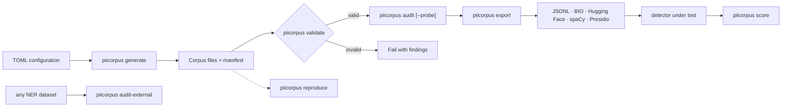

# PIIcorpus

[](https://github.com/rasam08/PIIcorpus/actions/workflows/ci.yml)
[](pyproject.toml)
[](LICENSE)
[](https://github.com/rasam08/PIIcorpus/releases/latest)

PIIcorpus is a Python package and command-line tool for deterministic synthetic contextual-PII
corpora. It provides corpus generation, structural validation, failure-mode auditing, format
export, byte-reproduction checks, and span-prediction scoring. The built-in generators do not use
real personal data.

The audit measures cross-split contamination, duplicate and near-duplicate records, template
concentration, morphology-to-label and shape-to-entity associations, cue associations,
within-split redundancy, value and context diversity, and generator fingerprints. An optional
character n-gram logistic-regression probe measures learnable surface signal using class-balanced
held-split metrics. The config-independent audit checks also accept external NER datasets.

PIIcorpus does not train or package machine-learning models. The scoring command evaluates
submitted span predictions against corpus annotations and reports aggregate and mechanism-specific
metrics.

## Processing pipeline


```mermaid
flowchart LR
    A["TOML configuration"] --> B["piicorpus generate"]
    B --> C["Corpus files + manifest"]
    C --> D{"piicorpus validate"}
    D -->|"valid"| E["piicorpus audit [--probe]"]
    D -->|"invalid"| X["Fail with findings"]
    E --> F["piicorpus export"]
    F --> G["JSONL · BIO · Hugging Face · spaCy · Presidio"]
    G --> H["detector under test"]
    H --> I["piicorpus score"]
    C -.-> R["piicorpus reproduce"]
    J["any NER dataset"] --> K["piicorpus audit-external"]
```

Generation is deterministic for a fixed package version, normalized configuration, and seed —
`piicorpus reproduce` verifies it by regenerating from the corpus's own configuration snapshot and
byte-comparing. Validation recalculates corpus invariants before audit, export, or scoring
consumes the files.

## Quick start

Python 3.11 or newer is required.

```console
python -m venv .venv
python -m pip install -e .
piicorpus generate --config configs/demo.toml --out demo-output
piicorpus validate demo-output
piicorpus audit demo-output --probe
piicorpus export demo-output --format huggingface
piicorpus reproduce demo-output
```

Two configurations are included:

- `configs/demo.toml` — a synthetic-prefix configuration. Labels `PATIENT_RECORD_ID`,
  `TRAVEL_DOCUMENT_ID`, `DRIVER_CREDENTIAL_ID`, and `BIRTH_DATE` use fictional identifier shapes
  beginning with `SYN-`. The shared affix exceeds the configured threshold, so the audit reports
  `value_shared_affix` as `WARN`.
- `configs/realistic-safe.toml` — reserved or invalid identifier surfaces: RFC 2606 emails, 555-01XX
  phone numbers, Luhn-invalid card shapes, RFC 5737 documentation IPs, and never-issued
  9XX-XX-XXXX national-id shapes. In verifier mode, each value plugin validates its own
  reservedness rule. These values do not require a synthetic prefix. See
  [`docs/DATA_SAFETY.md`](docs/DATA_SAFETY.md) for the validation rules.

The manifest records the seed, generator version, normalized configuration digest, counts, file
hashes, determinism metadata, and the CC0-1.0 generated-data license.

## What generation writes

```text
demo-output/
  corpus-config.json
  manifest.json
  splits/
    train.jsonl
    eval.jsonl
    holdout.jsonl
```

Running the same package version with the same configuration and seed produces byte-identical
files. A different seed changes generated records while keeping configured sizes, ratios, safety
rules, and diversity requirements intact. Splits draw personas, organizations, letters, and years
from shared pools partitioned by interleaving. This keeps pool members disjoint and avoids assigning
contiguous alphabetical or chronological ranges to individual splits. The partitioning does not
guarantee identical distributions for arbitrary user-supplied pools.

The repository forces LF line endings for JSON and JSONL files through `.gitattributes`, including
on Git for Windows checkouts, so checkout conversion does not invalidate corpus byte hashes.

## Validation failure example

The validator recalculates invariants from emitted files. It does not accept manifest counts as
proof. If a split is changed after generation, validation exits with code 1:

```text
FAIL: 2 validation finding(s)
- file_hash: SHA-256 mismatch for splits/eval.jsonl
- manifest_counts: manifest counts for eval do not match emitted records
```

Operational errors, such as a missing file or invalid TOML, exit with code 2 and are never presented
as a clean corpus verdict (`--traceback` re-raises them for debugging).

Audit, export, and score all run strict validation before consuming a corpus. Tampered records,
stale content-derived IDs, or inconsistent manifests exit with findings and produce no output by
default. `--forensic-allow-invalid` continues processing for diagnostic use while preserving the
failure status; it cannot produce a clean audit.

## Audit example

```text
PASS       shape_entity_shortcut     count=0  measured=0.8161 threshold=0.9
PASS       cue_label_shortcuts       count=59 measured=0.3151 threshold=0.45
PASS       intra_split_redundancy    count=0  measured=0.0    threshold=0.05
WARN       value_shared_affix        count=4  measured=11     threshold=6
PASS       probe_kind_separability   count=2  measured=0.8554 threshold=0.9
PASS       threshold_strictness      count=0
UNMEASURED same_generator_holdout_dependence
```

Every risk is reported as `PASS`, `FAIL`, `WARN`, or `UNMEASURED` with a count, the measured
value, the threshold it was judged against, and a reason. The `threshold_strictness` finding warns
whenever the corpus configuration is laxer than the recommended reference profile, and
`--profile reference` runs the audit with the reference thresholds directly. JSON and Markdown
output are available for automation and review. The full risk catalog is in
[`docs/FAILURE_MODEL.md`](docs/FAILURE_MODEL.md).

`--probe` trains deterministic one-vs-rest logistic regression on hashed character n-grams. It
reports balanced accuracy, macro-F1, raw accuracy, and split-specific baselines for kind,
value-to-label, and context-to-label prediction. A failure requires balanced accuracy above both
the configured ceiling and the majority-predictor baseline margin. A task is `UNMEASURED` when
its training data or every held split contains fewer than two observed classes.

> A holdout produced by the same generator is useful for regression testing but is not an
> independent generalization test.

## Auditing external datasets

The structural checks that need no generator metadata — contamination, duplicates, redundancy,
shape and marker shortcuts, value diversity, span integrity, and the probe — run on any NER
dataset:

```console
piicorpus audit-external --input-format hf --split train=train.jsonl --split test=test.jsonl
piicorpus audit-external data.conll --input-format conll
piicorpus audit-external records.jsonl --input-format jsonl  # import output is directly consumable
```

Checks that require the generating configuration report `UNMEASURED`, and a sensitive-content
scan over the text is reported as a warning (`--fail-on-safety` promotes it).

## Scoring a detector

`piicorpus score` consumes span predictions from any detector (see
[`docs/FORMAT.md`](docs/FORMAT.md) for the one-line-per-record format) and reports
precision/recall/F1 per label, family, kind, and split — plus mechanism diagnostics built from
the engineered families:

```text
diagnostics:
  cue_dependence                    0.04   (cued recall minus cue-free recall)
  conflict_gold_recall               1.0
  shape_hint_substitution_rate       0.0
  other_error_rate                   0.0
  abstention_rate                    0.0
  spoken_recall                     0.0
  over_trigger_per_hard_negative_family {'hard_negative_near_misses': 1.0, ...}
```

A detector that classifies entities only from value-shape regular expressions can over-trigger on
near-miss hard negatives because those records contain non-entity values with the same shapes as
positive annotations. These diagnostics apply to the supplied corpus and predictions; see
[`docs/CLAIM_BOUNDARIES.md`](docs/CLAIM_BOUNDARIES.md).

## Families and extension points

The demo covers narrative prose, structural records, OCR-like noise, spoken values, mixed-entity
documents, cue-free positives, cue-versus-shape conflicts, near misses, placeholders, negation,
documentation references, unrelated identifier-shaped values, and adjacent non-sensitive values.
Near-miss and adjacent negatives generate their values through the configured label plugins, so
hard negatives mirror the positive value distribution for any label set.

Configuration controls labels, cue surfaces, value plugins, family plugins, persona and
organization pools (`[surfaces]`), split sizes, class balance, diversity floors, audit thresholds,
probe ceilings, and safety rules. Applications register extensions with `register_value_plugin`,
`register_family`, `register_shape`, and `register_value_verifier`; no built-in label set is
required by the engine. The CLI loads registration modules with `--plugins mymodule` or
automatically through the `piicorpus.plugins` entry-point group:

```toml
[project.entry-points."piicorpus.plugins"]
acme = "acme_pii:register"
```

## Annotation and formats

Human-readable markup uses `[[ENTITY_TYPE:value]]`:

```text
The record identifier is [[PATIENT_RECORD_ID:SYN-ID-A10427]].
```

The parser emits clean text, Unicode code-point offsets, and UTF-8 byte offsets. Nested, unclosed,
malformed, or overlapping annotations are rejected. Exporters are provided for generic JSONL, BIO,
Hugging Face-compatible per-split JSONL, a spaCy-convertible JSONL form, and Presidio fixtures;
every export includes a `labels.json` tag map. Details are in [`docs/FORMAT.md`](docs/FORMAT.md).

Imported marked text remains `human_supplied` and unassigned; unannotated lines are typed
`unannotated`, not hard negatives. Import scans text for sensitive-content patterns and reports
findings in its manifest, but import does not establish consent, privacy, provenance, licensing,
safety, or release suitability, and it never mixes records into generated splits without a
separate explicit process.

## Architecture

- `config.py` parses and normalizes TOML, including surfaces, probe, and safety modes.
- `generator.py`, `skeletons.py`, and `morphology.py` implement deterministic plugin registries
  (values, families, shapes) and thirty-template-per-family banks.
- `plugins_realistic.py` provides reserved-surface value plugins with reservedness verifiers.
- `annotation.py` owns marked-text parsing and span round trips.
- `validators/` derives structural, diversity, hash, and safety verdicts from output files.
- `failure_model.py` runs the registered audit checks; `similarity.py` provides MinHash/LSH
  near-duplicate detection; `probe.py` is the trivial-model learnability probe;
  `profiles.py` holds the reference threshold profile.
- `scoring.py` compares detector predictions against a corpus.
- `importers/` (annotated and external) and `exporters/` keep provenance and spans explicit.

The base installation has no third-party runtime dependency.

## Limitations

- Audit and score results apply to the supplied files, implemented measurements, and configured
  thresholds; they are not estimates of performance on external data.
- A holdout produced by the same generator is not an independent evaluation set.
- Diversity counts and template counts measure distinct stored values and structures, not semantic
  coverage.
- PIIcorpus does not guarantee that generated identifiers are representative of production data;
  the reserved-surface plugins validate only that their values are reserved, fictional, or invalid
  under their configured rules.
- Regulatory compliance, de-identification, and deployment-readiness assessment are outside the
  package scope.
- External-performance measurement requires independently sourced evaluation data.
- The package generates, audits, exports, and scores corpus data; it does not train or approve
  models.

See [`docs/CLAIM_BOUNDARIES.md`](docs/CLAIM_BOUNDARIES.md) for the full boundary.

## Contributing and security

Install the reviewed development lock and the editable package, then run:

```console
python -m pip install --requirement requirements-dev.lock
python -m pip install --no-deps --no-build-isolation -e .
ruff check .
mypy src
pytest
python -m build
```

Contribution guidance is in [`CONTRIBUTING.md`](CONTRIBUTING.md). Report vulnerabilities through
[GitHub private vulnerability reporting](https://github.com/rasam08/PIIcorpus/security/advisories/new),
not a public issue.

## AI-assisted development

Development uses AI coding agents for implementation, refactoring, tests, documentation, and
technical analysis. Project decisions, acceptance criteria, review, and validation remain under
human control; the repository does not claim manual authorship of every source line.

Deterministic tests, explicit claim boundaries, byte-reproduction checks, and independent
validation are used to detect implementation errors, including errors introduced by AI-assisted
changes.

## License

Source code is Apache-2.0. Generated demo data is CC0-1.0; see `DATA_LICENSE`. User-supplied and
external data retains its own terms.
